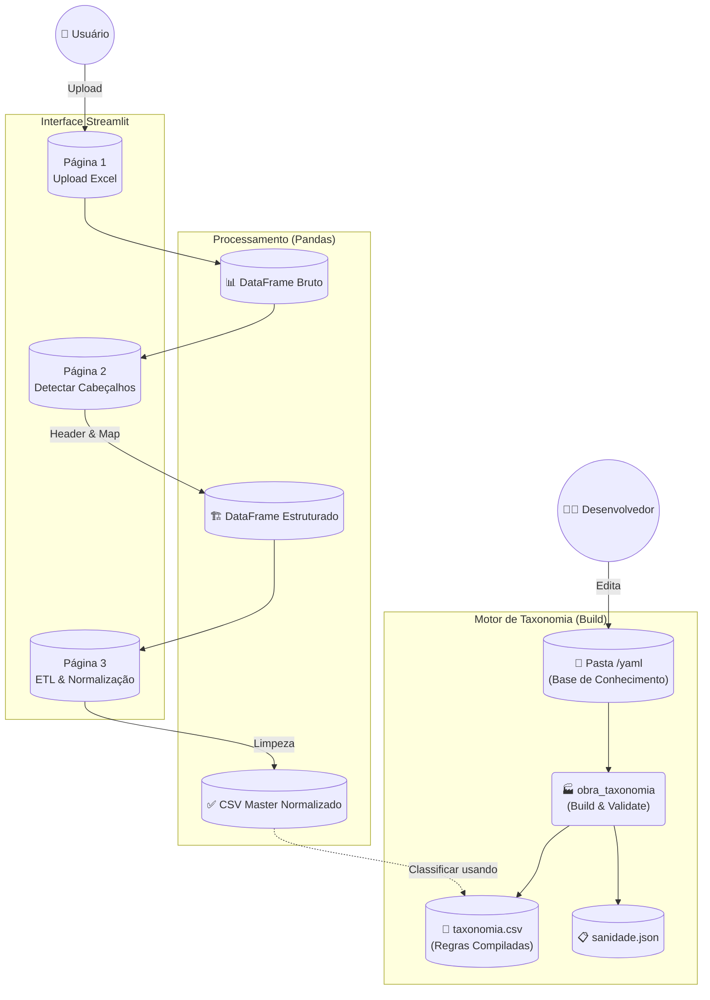

# Fluxo de Processamento do Sistema (End-to-End)

Este documento descreve o ciclo de vida completo da informação dentro do sistema ObraTaxonomia, detalhando a arquitetura técnica, o fluxo de dados e a governança de itens desconhecidos.

## 1. Arquitetura do Sistema

O sistema é construído sobre uma stack moderna de Python, priorizando performance de processamento e simplicidade de manutenção.

### Requisitos Técnicos e Stack
*   **Linguagem**: Python 3.9+
*   **Interface (Frontend)**: [Streamlit](https://streamlit.io/) (pela capacidade de prototipagem rápida e interatividade com dados).
*   **Processamento (Engine)**: [Pandas](https://pandas.pydata.org/) (para manipulação vetorial de DataFrames).
*   **Taxonomia Engine**: `obra_taxonomia` (Pacote proprietário para compilação e validação de regras).
*   **Serialização**: [PyYAML](https://pyyaml.org/) (para leitura human-friendly das regras).
*   **Armazenamento**: Filesystem local (CSV/Excel/YAML) - Sem dependência de banco de dados complexo para o MVP.

### Árvore do Projeto (Estrutura Real)
A organização das pastas segue o princípio da separação de responsabilidades e domínios de engenharia:

```text
/ObraTaxonomia
├── app/
│   ├── streamlit_app.py       # Entrypoint da aplicação Web
│   └── pages/                 # Páginas do App
│       ├── 1_Processar_Orcamento.py
│       ├── 2_Detectar_Cabecalhos.py
│       └── 3_Normalizacao_ETL.py
├── obra_taxonomia/            # [NEW] Motor de Taxonomia (Sanidade & Build)
│   ├── build.py               # CLI Builder
│   ├── validate.py            # Regras de Sanidade
│   ├── io_yaml.py             # Leitura Recursiva
│   └── serialize.py           # Output CSV/JSON
├── scripts/
│   ├── classify.py            # Motor de classificação (Consome taxonomia.csv)
│   └── ...
├── yaml/                      # [Input Humano] Base de Conhecimento
│   ├── unidades/              # Definições de unidades e conversões
│   ├── grupos/                # Agrupamentos de materiais (Concreto, Aço, etc.)
│   ├── elementos/             # Elementos construtivos (Vigas, Pilares)
│   └── ...                    # (Categorias diversas)
├── data/
│   ├── input/                 # (Temp) Uploads dos usuários
│   └── unknowns/              # [Input Máquina] Log de erros para a IA
├── taxonomia.csv              # [Output Build] O "Cérebro" compilado do sistema
├── sanidade_taxonomia.json    # [Output Build] Relatório de erros/warnings
└── requirements.txt           # Dependências do projeto
```

## 2. Visão Geral do Pipeline (Mermaid)



## 3. Detalhamento da Execução

### 3.1 Build da Taxonomia (Novo)
Antes de qualquer classificação, o motor `obra_taxonomia` deve rodar.
*   **Comando**: `python -m obra_taxonomia.build`
*   **Função**: Lê recursivamente todos os YAMLs, valida unicidade de apelidos, checa campos obrigatórios e gera o `taxonomia.csv`.
*   **Garantia**: Se o build passar (modo tolerante ou estrito), o CSV gerado é determinístico e seguro para uso.

### 3.2 Ingestão (Páginas 1, 2 e 3)
O app foi reestruturado em etapas discretas:
1.  **Página 1 (Upload)**: Foca apenas em ler o binário do Excel (xlsx/xls) e "abrir" as abas sem perder dados.
2.  **Página 2 (Cabeçalhos)**: Usa heurísticas para achar onde começa a tabela e mapeia colunas para o padrão (`descricao`, `unidade`, etc.).
3.  **Página 3 (ETL)**: Limpa sujeira (strings vazias, colunas nulas, normalização de texto) e prepara um CSV Master limpo.

### 3.3 Classificação (Futuro)
O CSV Master Normalizado será cruzado com o `taxonomia.csv`. O motor de classificação (que será atualizado) não lerá mais YAMLs diretamente, mas sim este CSV otimizado.
