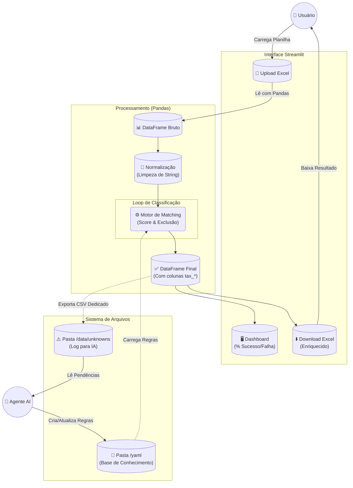

# Fluxo de Processamento do Sistema (End-to-End)

Este documento descreve o ciclo de vida completo da informação dentro do sistema ObraTaxonomia, detalhando a arquitetura técnica, o fluxo de dados e a governança de itens desconhecidos.

## 1. Arquitetura do Sistema

O sistema é construído sobre uma stack moderna de Python, priorizando performance de processamento e simplicidade de manutenção.

### Requisitos Técnicos e Stack
*   **Linguagem**: Python 3.9+
*   **Interface (Frontend)**: [Streamlit](https://streamlit.io/) (pela capacidade de prototipagem rápida e interatividade com dados).
*   **Processamento (Engine)**: [Pandas](https://pandas.pydata.org/) (para manipulação vetorial de DataFrames).
*   **Serialização**: [PyYAML](https://pyyaml.org/) (para leitura human-friendly das regras).
*   **Armazenamento**: Filesystem local (CSV/Excel/YAML) - Sem dependência de banco de dados complexo para o MVP.

### Árvore do Projeto (Estrutura Real)
A organização das pastas segue o princípio da separação de responsabilidades e domínios de engenharia:

```text
/ObraTaxonomia
├── app/
│   ├── streamlit_app.py       # Entrypoint da aplicação Web
│   └── components/            # Widgets reutilizáveis de UI
├── scripts/
│   ├── classify.py            # Motor de classificação (Lógica Pura)
│   ├── builder.py             # Compilador de YAML -> Hash Map
│   └── utils.py               # Helpers (Regex, Normalização)
├── yaml/                      # [Input Humano] Base de Conhecimento
│   ├── unidades/              # Definições de unidades e conversões
│   ├── grupos/                # Agrupamentos de materiais (Concreto, Aço, etc.)
│   ├── elementos/             # Elementos construtivos (Vigas, Pilares)
│   ├── estruturas/            # Tipologias de estruturas
│   ├── equipamentos/          # Maquinário e ferramentas
│   ├── mao_obra/              # Categorias de trabalho humano
│   ├── materiais/             # Insumos puros
│   ├── obras/                 # Contextos de obras
│   └── servico/               # Serviços compostos
├── data/
│   ├── input/                 # (Temp) Uploads dos usuários
│   └── unknowns/              # [Input Máquina] Log de erros para a IA
│       ├── 20240118_refugo.csv
│       ├── 20240119_pendencias.csv
│       └── ...
├── artifacts/                 # [Output Build] Cache de performance
│   └── taxonomy_hash.pkl      # Árvore de regras compilada (Pickle)
└── requirements.txt           # Dependências do projeto
```

## 2. Visão Geral do Pipeline (Mermaid)



## 3. Detalhamento da Execução

### 3.1 Entrada e Ingestão
*   **Ação**: O usuário acessa a interface Streamlit e faz upload do arquivo `.xlsx`.
*   **Normalização**: O sistema aplica regex para separar números de unidades (`fck30` → `fck 30`) e normaliza unidades (`pç` → `un`).
*   **Idempotência**: Colunas `tax_` pré-existentes são descartadas para garantir reprocessamento limpo.

### 3.2 O Processamento (Runtime)
O script utiliza dicionários em memória (Hashes) gerados a partir dos YAMLs para classificar cada linha em O(1) sempre que possível.
*   **Output**: Cada linha recebe `tax_apelido`, `tax_tipo`, `tax_desconhecido` (True/False).

### 3.3 Saída Dupla de "Desconhecidos"
Esta é a funcionalidade chave para o ciclo de aprendizado. O sistema bifurca a saída:

1.  **Feedback Imediato (User)**: O usuário baixa o Excel original com a coluna `tax_desconhecido = TRUE` e formatação condicional (ex: vermelho). Isso permite correção manual pontual se necessário.
2.  **Log de Aprendizado (System)**: O sistema gera **silenciosamente** um arquivo CSV contendo APENAS as linhas não reconhecidas.
    *   **Destino**: `data/unknowns/`
    *   **Conteúdo**: `descricao_original`, `unidade_original`, `arquivo_origem`, `timestamp`.
    *   **Por que CSV?**: Formato leve, texto puro, ideal para ser lido por Agentes de IA e scripts de automação sem o overhead de formatação do Excel.

### 3.4 Ciclo de Resolução (AI Feedback Loop)
1.  **Monitoramento**: O Agente Antigravity varre a pasta `data/unknowns/`.
2.  **Update**: Baseado no prompt de `desconhecido.md`, o agente edita os arquivos YAML para cobrir as lacunas.
3.  **Fechamento**: Na próxima execução, o motor de matching (agora "mais inteligente") reconhecerá automaticamente os itens que antes eram desconhecidos.
