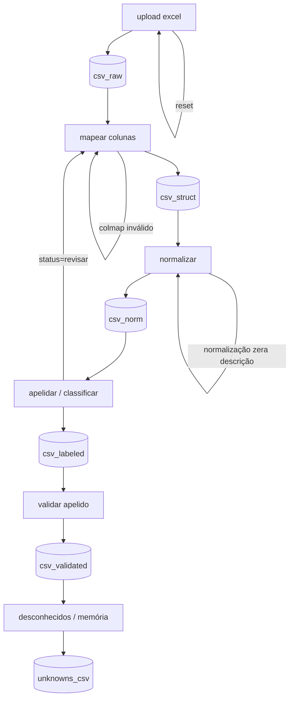

**arquitetura — obrataxonomia (v4) (ux minimalista + validação de apelido + unknowns para ia)**

este documento define o fluxo do obrataxonomia para:

1. upload de excel → csv na sessão
2. validação do usuário do mapa de colunas
3. normalização de texto e números
4. sugestão de apelido + validação humana (saída principal)
5. geração de unknowns agregados para alimentar ia/memória (saída secundária)

---

1. princípios e críticas (curto e útil)

1) o artefato mestre da sessão é csv (`st.session_state['csv_*']`). dataframe é sempre derivado.
2) sem mapa de colunas validado não existe pipeline (limpeza antes disso é chute).
3) normalização e apelidar são etapas diferentes (e auditáveis).
4) a etapa de apelidar exige validação do usuário (o sistema sugere, o humano assina).
5) unknowns não são “erro”; são fila de melhoria contínua.

---

2. regras de ux minimalista (padrão repetível)

1) uma coluna principal. sidebar só para status e ações raras.
2) cada página tem sempre 3 blocos, nesta ordem:

   1. entrada (um formulário curto)
   2. resumo (contagens + head/tail)
   3. ação (um botão principal + um secundário)
3) previews sempre iguais: head(10), tail(10) e métricas.
4) uma decisão por tela: upload, mapear, normalizar, validar apelidos, exportar unknowns.
5) widgets:

   1. até ~8 opções: `st.pills`
   2. muitas opções: `st.selectbox` ou `st.data_editor`
   3. 2–3 opções: `st.segmented_control` ou `st.radio`
6) sempre ter: `resetar sessão`.

---

3. contrato de dados (runtime)
   colunas padrão internas:

* obrigatórias: `descricao`, `unidade`, `quantidade`
* opcionais: `codigo`, `preco_unit`, `preco_total`
* técnicas: `id_linha`, `linha_origem`, `aba_origem`

saída do classificador (runtime):

* sugestão automática: `apelido_sugerido`, `alternativa`, `score`, `status`, `motivo`
* validação humana: `apelido_final`, `validado` (bool)
* opcional (para revisão): `semelhantes` (top candidatos) e `unidade_sugerida`

status (enum): `ok` | `revisar` | `desconhecido`

---

4. estado mínimo (st.session_state)
   | chave | tipo | o que é |
   |---|---|---|
   | excel_bytes | bytes | arquivo original |
   | sheet_mode | str | uma aba | concatenar abas |
   | sheet_selected | str | nome da aba (se aplicável) |
   | csv_raw | str | csv bruto (logo após leitura) |
   | colmap | dict | mapa validado pelo usuário |
   | csv_struct | str | csv com colunas padrão + id_linha |
   | csv_norm | str | csv normalizado |
   | csv_labeled | str | csv com sugestão automática de apelido |
   | csv_validated | str | csv final apelidado + validado (saída principal) |
   | unknowns_csv | str | unknowns agregados p/ ia/memória (saída secundária) |
   | audit_log | list/df | eventos por etapa |

---

5. fluxo geral (mermaid) (compatível github)
   observação: o erro que você viu acontece quando o renderizador “cola” tudo na mesma linha. para evitar, este diagrama usa `;` no fim de cada instrução.



---

6. páginas (mockup + componentes streamlit + validações)

a regra: cada página descreve objetivo, mockup, componentes, saídas, validações.

6.1) página 1 — upload excel → `csv_raw`
objetivo: carregar excel, escolher modo e gerar `csv_raw`.

mockup

```text
[arquivo]   st.file_uploader
[modo]      st.pills    (uma aba | concatenar abas)
[aba]       st.pills / st.selectbox (pills se poucas abas)

resumo
- linhas / colunas / abas  st.metric

preview
- head(10)  st.dataframe
- tail(10)  st.dataframe

ações
[continuar] st.button   [resetar sessão] st.button
```

componentes

* `st.file_uploader`, `st.pills`, `st.selectbox`
* `st.metric`, `st.dataframe`, `st.button`
* opcional: `st.sidebar.caption` (status da sessão)

saídas

* `excel_bytes`, `sheet_mode`, `sheet_selected`, `csv_raw`

validações

1. arquivo vazio: bloquear (`st.error`).
2. aba “não tabela”: warning (`st.warning`).

---

6.2) página 2 — mapear colunas → `colmap` + `csv_struct`
objetivo: usuário valida quais colunas do excel viram o padrão do sistema.

mockup

```text
mapa de colunas (editável)
- tabela: campo padrão x coluna do arquivo   st.data_editor

resumo
- avisos + colunas escolhidas               st.caption

preview
- head(10) / tail(10) já renomeado          st.dataframe

ações
[aplicar mapa] st.button   [voltar] st.button
```

componentes

* principal: `st.data_editor` + `column_config.SelectboxColumn`
* alternativa (arquivo simples): `st.pills` por campo
* `st.dataframe`, `st.caption`, `st.warning`, `st.error`

saídas

* `colmap`
* `csv_struct` com `id_linha` + colunas padrão

validações

1. impedir duplicidade no mapeamento.
2. validar `quantidade` numérica (mostrar % inválida).
3. `unidade` vazia: warning.

---

6.3) página 3 — normalizar → `csv_norm`
objetivo: normalizar texto e números com auditoria.

mockup

```text
regras
[minúsculo] [stopwords] [pontuação] [números]   st.checkbox

amostra antes/depois                                st.dataframe

resumo
- linhas alteradas por regra                         st.caption

ações
[aplicar normalização] st.button   [voltar] st.button
```

componentes

* `st.checkbox`, `st.dataframe`, `st.caption`, `st.button`
* opcional: `st.tabs` (amostra | avisos | auditoria)

saídas

* `csv_norm`
* `audit_log`

validações

1. se normalização zera descrição: reverter naquela linha + warning.
2. decimal `,` vs `.`: detectar e avisar.

---

6.4) página 4 — apelidar / classificar + validação → `csv_validated`
objetivo: sugerir `apelido` e pedir validação do usuário. a saída principal é `apelidado_validado.csv`. a saída secundária é `unknowns_antigravity.csv`.

mockup

```text
resumo
ok / revisar / desconhecido / validados     st.metric

controles
[mostrar semelhantes]                       st.toggle (default off)
[filtrar status] ok | revisar | desconhecido st.pills

lista (editável)
- descricao_norm, unidade, quantidade,
  apelido_sugerido, apelido_final, validado, score, motivo
  + semelhantes (aparece só com toggle)     st.data_editor

ações
[baixar apelidado_validado.csv]            st.download_button
[baixar unknowns_antigravity.csv]          st.download_button
[continuar] st.button   [voltar] st.button
```

componentes

* `st.metric`, `st.toggle`, `st.pills`
* `st.data_editor`

  * `validado`: `CheckboxColumn`
  * `apelido_final`: `TextColumn` (mvp) ou `SelectboxColumn` (se quiser restringir a candidatos)
  * `semelhantes`: oculto por padrão (toggle off)
* `st.download_button`, `st.text_input` (busca)

saídas

* `csv_labeled` (sugestão automática)
* `csv_validated` (saída principal)
* `unknowns_csv` (saída secundária, pronta para ia)

validações

1. `desconhecido`: `apelido_final` vazio + `validado=false` e entra em unknowns.
2. `revisar`: não bloqueia no mvp, mas sinaliza pendentes.
3. semelhantes default off para não poluir no celular.

---

6.5) página 5 — desconhecidos → `unknowns_csv` + log persistente
objetivo: unknowns agregados para alimentar ia (ex.: antigravity) e/ou virar backlog de taxonomia.

mockup

```text
resumo
unknowns: n linhas      st.metric

agregado
descricao_norm | unidade | ocorrencias | exemplos  st.dataframe

ações
[baixar unknowns_antigravity.csv]          st.download_button
[finalizar] st.button   [voltar] st.button
```

componentes

* `st.metric`, `st.dataframe`, `st.download_button`, `st.button`
* opcional: `st.expander` com instrução curta

saídas

* `unknowns_csv`
* persistência mvp: salvar também em `/data/unknowns/unknowns_aaaa-mm-dd_hhmm.csv`

schema recomendado de unknowns (para ia)

* `descricao_norm`
* `unidade`
* `ocorrencias`
* `exemplos` (2–5 exemplos curtos)
* `descricao_original_exemplo`
* `aba_origem_exemplo`
* `arquivo_exemplo`

---

7. build da taxonomia (contrato rígido)

* comando: `python -m obra_taxonomia.build`
* outputs: `taxonomia.csv` + `sanidade_taxonomia.json`
* validações mínimas:

  1. unicidade global de `apelido`
  2. unidades válidas (tabela de equivalências)
  3. export determinístico (mesma entrada → mesmo csv)

---

8. checklist de sanidade (antes de chamar de mvp)

1) reset limpa a sessão sem deixar lixo.
2) usuário termina com 3 decisões: aba, mapa de colunas, validar/exportar.
3) saída principal sempre disponível: `apelidado_validado.csv`.
4) saída secundária sempre disponível: `unknowns_antigravity.csv`.
5) cada página tem um único botão principal.
6) todos os previews são consistentes (head/tail/contagem).
