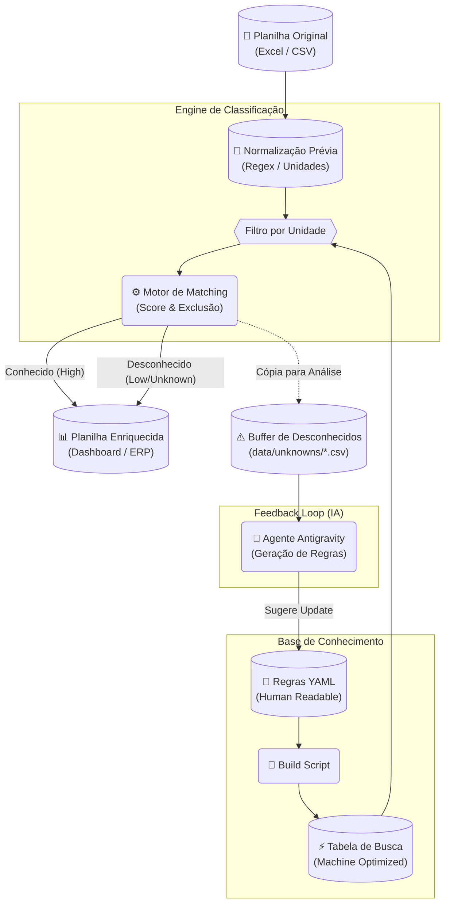

# Fluxo de Processamento do Sistema (End-to-End)

Este documento descreve o ciclo de vida completo da informação dentro do sistema ObraTaxonomia, desde a ingestão da planilha "suja" até o enriquecimento dos dados e o ciclo de aprendizado contínuo.

## Visão Geral do Pipeline

O sistema opera em um modelo híbrido: **Determinístico para Execução Rápida** e **Assistido por IA para Manutenção**.

## Detalhamento das Etapas

### 1. Ingestão e Limpeza (Preprocessing)
Antes de qualquer tentativa de classificação, o dado bruto passa por um saneamento rigoroso para maximizar as chances de match.
- **Normalização de Texto**: Remoção de acentos, dupla espaçamento e caracteres especiais não-funcionais.
- **Sticky Numbers**: Separação de números colados a unidades (ex: `fck30` -> `fck 30`) para correta tokenização.
- **Unificação de Unidades**: Conversão de sinônimos (ex: `pç`, `und`, `peça`) para a chave canônica (`un`) usando o dicionário `unidades.yaml`.

### 2. Compilação da Base (Build Time)
Para garantir alta performance (milhares de linhas/segundo), o sistema não lê os arquivos YAML em tempo de execução.
- **Build Script**: Um processo converte a árvore de diretórios YAML em uma estrutura plana e otimizada (Hash Map / Índice Invertido) carregada em memória.
- **Validação**: Verifica integridade referencial (duplicatas, unidades inválidas) antes de subir o sistema.

### 3. Motor de Decisão (Runtime)
O coração do sistema aplica a lógica de engenharia em funil:
1.  **Hard Filter (Unidade)**: Se a linha é `kg`, descarta todas as regras de `m3`. Isso economiza processamento e evita erros grosseiros.
2.  **Exclusão (Match Exclude)**: Verifica palavras proibidas na regra (ex: "lançamento" invalida "material").
3.  **Pontuação (Score)**: Verifica a presença dos termos obrigatórios (`contem`) e calcula a pontuação baseada na prioridade da regra e no número de matches.

### 4. Tratamento de Exceções (Feedback Loop)
O que o sistema não reconhece não é perdido.
- **Marcação no Output**: O usuário recebe a planilha de volta com a coluna `tax_desconhecido = TRUE`, permitindo filtro e correção manual se desejar.
- **Coleta Passiva**: O sistema salva silenciosamente os itens não reconhecidos na pasta `data/unknowns`.
- **Evolução**: Periodicamente, o **Agente Antigravity** lê essa pasta e sugere novos snippets YAML, fechando o ciclo e tornando o sistema mais inteligente a cada uso.
