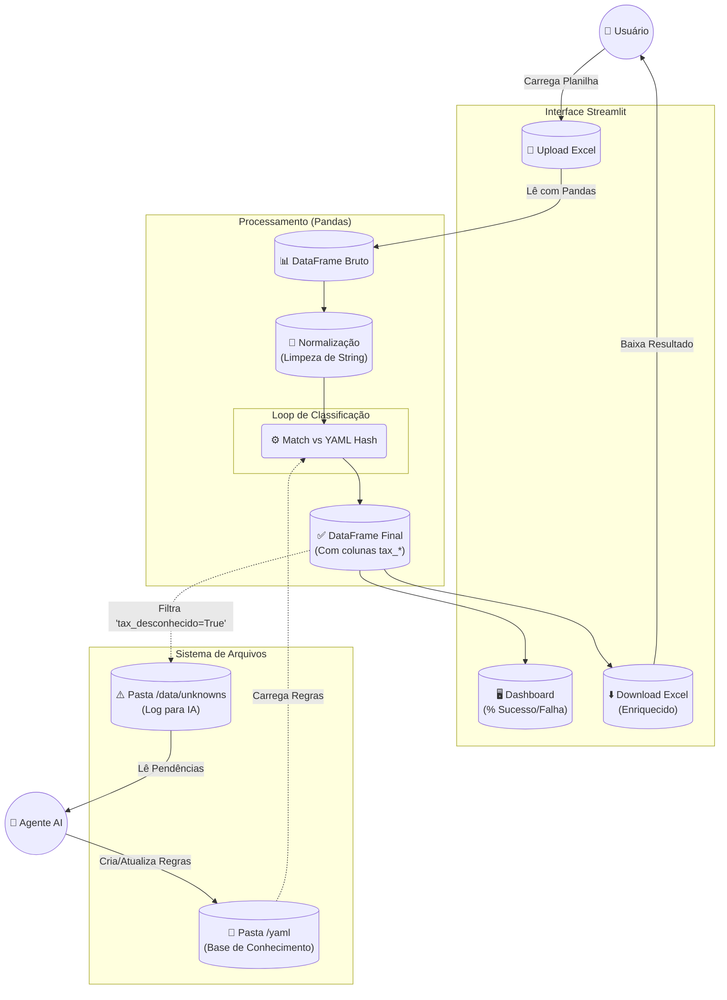

# Fluxo de Processamento do Sistema (End-to-End)

Este documento descreve o ciclo de vida completo da informação dentro do sistema ObraTaxonomia, detalhando a interação via Streamlit, o processamento com Pandas e o ciclo de feedback para resolução de itens desconhecidos.

## Visão Geral do Pipeline (Streamlit + Pandas)

O sistema opera sobre uma interface web (Streamlit) que orquestra a leitura de Excel, classificação em memória e geração de saídas.

## Detalhamento da Execução

### 1. Entrada e Ingestão (Streamlit e Pandas)
*   **Ação**: O usuário acessa a interface Streamlit e faz upload do arquivo `.xlsx` de orçamento.
*   **Técnica**: O Pandas lê o arquivo em memória (`pd.read_excel`).
*   **Idempotência**: Se a planilha já tiver colunas `tax_`, elas são removidas para garantir um processamento limpo baseada nas regras atuais.

### 2. O Processamento (Runtime)
O script itera sobre o DataFrame (ou usa vetorização do Pandas quando possível) para aplicar as regras carregadas dos YAMLs.
*   Os arquivos YAML são carregados apenas uma vez (cache) e convertidos em dicionários para busca rápida.
*   Cada linha recebe as tags: `tax_apelido`, `tax_tipo` e `tax_desconhecido`.

### 3. Saída Dupla de "Desconhecidos"
Quando o sistema encontra um item sem match, ele realiza duas ações simultâneas:
1.  **Para o Usuário (Curto Prazo)**: O item é devolvido no Excel de download marcado com `tax_desconhecido = TRUE` (e colorido visualmente na UI). O engenheiro pode corrigir manualmente na planilha se tiver pressa.
2.  **Para o Sistema (Longo Prazo)**: O sistema salva automaticamente (sem ação do usuário) uma cópia desses itens não reconhecidos em um arquivo CSV na pasta `data/unknowns/`.
    *   *Formato*: `{timestamp}_unknowns.csv`.

### 4. Ciclo de Resolução (Como o "Desconhecido" vira "Conhecido")
Este é o momento onde o aprendizado ocorre.
1.  **Monitoramento**: O Agente Antigravity monitora a pasta `data/unknowns/`.
2.  **Atualização**: O Agente cria novas regras nos arquivos YAML (ex: adiciona "cimento cp2" em `aglomerantes.yaml`) com base no prompt definido em `desconhecido.md`.
3.  **Re-processamento**:
    *   No dia seguinte (ou após o update), quando o usuário subir **a mesma planilha** (ou outra similar), o sistema vai reler os YAMLs (agora atualizados).
    *   O que antes era `tax_desconhecido = TRUE` passará a ter um match (ex: `tax_apelido = cimento_saco_50kg`), fechando o ciclo.

