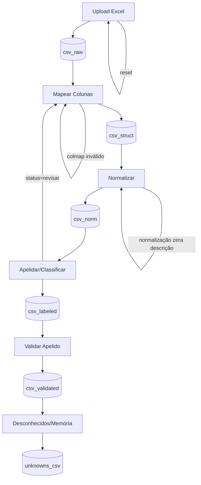

# Roteiro de Atualização do ObraTaxonomia

**Data:** 2026-01-24  
**Versão Alvo:** v4 (UX Minimalista + Validação de Apelido + Unknowns para IA)

---

## 📋 Resumo Executivo

Este documento apresenta um roteiro passo a passo para atualizar o código do **ObraTaxonomia** de acordo com a arquitetura definida nos documentos de referência. O objetivo é implementar um fluxo completo de processamento de orçamentos, desde o upload do Excel até a geração de arquivos validados e unknowns para alimentar IA.

### Documentos de Referência Analisados

1. **arquitetura.md** - Define o fluxo completo em 5 páginas (Upload → Mapear → Normalizar → Apelidar → Desconhecidos)
2. **reconhecimento.md** - Especificação técnica do MVP com algoritmo de matching
3. **taxonomia.md** - Repositório de taxonomia e estrutura de YAMLs
4. **yaml_to_json.md** - Build de regras YAML para JSON master
5. **desconhecido.md** - Tratamento de itens desconhecidos e ciclo de melhoria contínua
6. **excel_to_csv.md** - Utilitário de conversão XLSX para CSV (8 métodos)

---

## 🎯 Objetivos da Atualização

1. ✅ Implementar fluxo de 5 páginas com UX minimalista
2. ✅ Garantir validação humana de apelidos (saída principal)
3. ✅ Gerar unknowns agregados para IA (saída secundária)
4. ✅ Manter CSV como artefato mestre da sessão
5. ✅ Implementar auditoria e rastreabilidade completa

---

## 📐 Princípios Arquiteturais

### Regras de Ouro

1. **CSV é o artefato mestre** - `st.session_state['csv_*']`, DataFrame é sempre derivado
2. **Sem mapa validado, não há pipeline** - Limpeza antes disso é chute
3. **Normalização e apelidar são etapas separadas** - Auditáveis independentemente
4. **Apelidar exige validação humana** - Sistema sugere, humano assina
5. **Unknowns não são erro** - São fila de melhoria contínua

### Padrão UX Minimalista

- **Uma coluna principal** - Sidebar só para status e ações raras
- **3 blocos por página**: Entrada → Resumo → Ação
- **Previews consistentes**: head(10), tail(10) e métricas
- **Uma decisão por tela**
- **Widgets apropriados**:
  - Até ~8 opções: `st.pills`
  - Muitas opções: `st.selectbox` ou `st.data_editor`
  - 2-3 opções: `st.segmented_control` ou `st.radio`

---

## 🗂️ Estado da Sessão (st.session_state)

### Chaves Obrigatórias

| Chave | Tipo | Descrição |
|-------|------|-----------|
| `excel_bytes` | bytes | Arquivo original |
| `sheet_mode` | str | "uma aba" ou "concatenar abas" |
| `sheet_selected` | str | Nome da aba (se aplicável) |
| `csv_raw` | str | CSV bruto (logo após leitura) |
| `colmap` | dict | Mapa validado pelo usuário |
| `csv_struct` | str | CSV com colunas padrão + id_linha |
| `csv_norm` | str | CSV normalizado |
| `csv_labeled` | str | CSV com sugestão automática de apelido |
| `csv_validated` | str | CSV final apelidado + validado (saída principal) |
| `unknowns_csv` | str | Unknowns agregados para IA (saída secundária) |
| `audit_log` | list/df | Eventos por etapa |

---

## 🔄 Fluxo Geral (5 Páginas)



---

## 📝 Roteiro de Implementação

### Fase 1: Preparação e Estrutura Base

#### 1.1 Revisar Estrutura de Diretórios

**Objetivo:** Garantir que a estrutura de pastas está alinhada com a arquitetura.

**Ações:**
- [ ] Verificar existência de `data/master/` para `reconhecimento_master.json` e `sanidade_master.json`
- [ ] Verificar existência de `data/unknowns/inbox/`, `data/unknowns/processed/`, `data/unknowns/archive/`
- [ ] Verificar estrutura `yaml/` com subpastas (elementos, servicos, unidades, etc.)
- [ ] Criar pastas faltantes se necessário

**Arquivos afetados:**
- Estrutura de diretórios do projeto

**Critério de sucesso:**
- Todas as pastas necessárias existem e estão vazias ou com arquivos de exemplo

---

#### 1.2 Implementar Build de Taxonomia (YAML → JSON Master)

**Objetivo:** Criar script que compila YAMLs em `reconhecimento_master.json`.

**Ações:**
- [ ] Criar/atualizar `scripts/build_reconhecimento.py`
- [ ] Implementar função `yaml_to_master(yaml_root, out_dir, mode="rebuild")`
- [ ] Implementar normalização de tokens (lower, sem acento, sem pontuação)
- [ ] Implementar validações:
  - Unicidade de `apelido`
  - Validação de `unit` contra `yaml/unidades.yaml`
  - Grupos `contem` não vazios
  - Detecção de tokens em `must` e `must_not` simultaneamente (warning)
- [ ] Gerar índices `by_apelido` e `by_unit` para performance
- [ ] Gerar `sanidade_master.json` com:
  - `yaml_fingerprint` (hash determinístico)
  - Contagem de arquivos e regras
  - Distribuição por unidade
  - Warnings e duplicatas
- [ ] Implementar testes de sanidade

**Arquivos afetados:**
- `scripts/build_reconhecimento.py` (criar/atualizar)
- `data/master/reconhecimento_master.json` (gerado)
- `data/master/sanidade_master.json` (gerado)

**Critério de sucesso:**
- Build roda sem erros
- JSON master gerado é determinístico (mesma entrada → mesmo output)
- Sanidade detecta duplicatas e unidades inválidas

---

#### 1.3 Validar YAMLs Existentes

**Objetivo:** Garantir que todos os YAMLs seguem o schema correto.

**Ações:**
- [ ] Criar/atualizar `scripts/validate_yaml.py`
- [ ] Validar schema de cada YAML:
  - `apelido` (string, obrigatório)
  - `unit` (string, obrigatório, válido em `unidades.yaml`)
  - `contem` (lista de listas, obrigatório)
  - `ignorar` (lista de listas, opcional)
- [ ] Gerar relatório de validação
- [ ] Corrigir YAMLs com erros

**Arquivos afetados:**
- `scripts/validate_yaml.py` (criar/atualizar)
- Todos os arquivos `yaml/**/*.yaml`

**Critério de sucesso:**
- Todos os YAMLs passam na validação
- Relatório mostra 0 erros críticos

---

### Fase 2: Implementação do Backend (Lógica de Negócio)

#### 2.1 Módulo de Conversão Excel → CSV

**Objetivo:** Implementar conversão robusta com fallback de 8 métodos.

**Ações:**
- [ ] Verificar existência de `scripts/utils.py` ou similar
- [ ] Implementar função `convert_xlsx_to_csv_all_methods(xlsx_path, output_dir)`
- [ ] Implementar 8 métodos de conversão (conforme `excel_to_csv.md`):
  1. Pandas
  2. Openpyxl
  3. Xlsx2csv
  4. Polars
  5. Win32com
  6. Xlwings
  7. Pyexcel
  8. Python-Calamine
- [ ] Implementar fallback automático
- [ ] Retornar estrutura com `success`, `method`, `message`, `output_files`, `attempts`
- [ ] Usar encoding `utf-8-sig` para compatibilidade com Excel

**Arquivos afetados:**
- `scripts/utils.py` (criar/atualizar)

**Critério de sucesso:**
- Conversão funciona com pelo menos Pandas + Openpyxl
- Fallback automático funciona quando método primário falha
- Todas as abas são convertidas

---

#### 2.2 Módulo de Normalização

**Objetivo:** Implementar normalização de texto e números com auditoria.

**Ações:**
- [ ] Criar `scripts/normalize.py`
- [ ] Implementar normalização de texto:
  - Minúsculo
  - Remoção de acentos
  - Remoção de pontuação
  - Remoção de stopwords (opcional)
  - Regex para números colados (ex: `fck30` → `fck 30`)
  - Preservar traços de argamassa (`1:3` não deve virar `1 3`)
- [ ] Implementar normalização de números:
  - Detectar decimal `,` vs `.`
  - Converter para formato padrão
- [ ] Implementar auditoria:
  - Registrar linhas alteradas por regra
  - Detectar descrições zeradas (reverter + warning)
- [ ] Retornar `csv_norm` + `audit_log`

**Arquivos afetados:**
- `scripts/normalize.py` (criar)

**Critério de sucesso:**
- Normalização não zera descrições
- Auditoria registra todas as alterações
- Números são normalizados corretamente

---

#### 2.3 Módulo de Classificação (Matching)

**Objetivo:** Implementar algoritmo de matching conforme especificação.

**Ações:**
- [ ] Criar/atualizar `scripts/classify.py`
- [ ] Implementar carregamento de `reconhecimento_master.json` com cache
- [ ] Implementar pipeline de matching:
  1. Filtro de unidade (usar índice `by_unit`)
  2. Filtro de exclusão (`must_not` - hard filter)
  3. Verificação de requisitos (`must` - soft filter)
  4. Cálculo de score: `(Prioridade × 100) + (TotalTokensMatch × 10)`
- [ ] Implementar critérios de confiança:
  - `HIGH`: vencedor único com margem > 20 pontos
  - `LOW`: empate ou margem apertada
  - `UNIT_MISMATCH`: texto bate, unidade não
  - `UNKNOWN`: nenhuma regra satisfeita
- [ ] Gerar colunas de saída:
  - `apelido_sugerido`
  - `alternativa` (segundo melhor)
  - `score`
  - `status` (ok | revisar | desconhecido)
  - `motivo`
  - `semelhantes` (top candidatos)
  - `unidade_sugerida`
- [ ] Retornar `csv_labeled`

**Arquivos afetados:**
- `scripts/classify.py` (criar/atualizar)

**Critério de sucesso:**
- Matching funciona com precisão > recall (preferir UNKNOWN a falso positivo)
- Score diferencia regras específicas de genéricas
- Índice por unidade acelera processamento

---

#### 2.4 Módulo de Unknowns

**Objetivo:** Consolidar e agregar itens desconhecidos para IA.

**Ações:**
- [ ] Criar `scripts/unknowns.py`
- [ ] Implementar consolidação de unknowns:
  - Agrupar por (`descricao_norm`, `unidade_canonica`)
  - Somar `frequencia`
  - Manter amostras de origem (top 3)
  - Ordenar por frequência desc
- [ ] Implementar geração de JSONL:
  - Campos obrigatórios: `descricao_original`, `unidade_original`, `frequencia`, `arquivo_origem`
  - Campos recomendados: `descricao_norm`, `unidade_canonica`, `motivo_desconhecido`, `top_candidates`
- [ ] Salvar em `data/unknowns/inbox/` com naming: `YYYY-MM-DD_HHMM_<origem>_unknowns.jsonl`
- [ ] Retornar `unknowns_csv` (também em CSV para compatibilidade)

**Arquivos afetados:**
- `scripts/unknowns.py` (criar)

**Critério de sucesso:**
- Unknowns são deduplicados e agregados
- Formato JSONL é válido
- Arquivo salvo em `inbox/` com timestamp

---

### Fase 3: Implementação do Frontend (Streamlit)

#### 3.1 Página 1 - Upload Excel → csv_raw

**Objetivo:** Carregar Excel, escolher modo e gerar `csv_raw`.

**Mockup:**
```
[arquivo]   st.file_uploader
[modo]      st.pills    (uma aba | concatenar abas)
[aba]       st.pills / st.selectbox (pills se poucas abas)

Resumo
- linhas / colunas / abas  st.metric

Preview
- head(10)  st.dataframe
- tail(10)  st.dataframe

Ações
[continuar] st.button   [resetar sessão] st.button
```

**Ações:**
- [ ] Criar/atualizar `app/pages/1_Upload_Excel.py`
- [ ] Implementar `st.file_uploader` para `.xlsx`
- [ ] Implementar `st.pills` para modo (uma aba | concatenar abas)
- [ ] Implementar seleção de aba com `st.pills` ou `st.selectbox`
- [ ] Chamar `convert_xlsx_to_csv_all_methods()` ao carregar arquivo
- [ ] Armazenar em `st.session_state`:
  - `excel_bytes`
  - `sheet_mode`
  - `sheet_selected`
  - `csv_raw`
- [ ] Exibir métricas (linhas, colunas, abas)
- [ ] Exibir preview (head/tail)
- [ ] Implementar validações:
  - Arquivo vazio: `st.error` e bloquear
  - Aba "não tabela": `st.warning`
- [ ] Implementar botão "Resetar Sessão" (limpa todo `st.session_state`)

**Arquivos afetados:**
- `app/pages/1_Upload_Excel.py` (criar/atualizar)

**Critério de sucesso:**
- Upload funciona com arquivos reais
- Modo e aba são selecionáveis
- `csv_raw` é gerado corretamente
- Preview mostra dados corretos

---

#### 3.2 Página 2 - Mapear Colunas → colmap + csv_struct

**Objetivo:** Usuário valida quais colunas do Excel viram padrão do sistema.

**Mockup:**
```
Mapa de Colunas (editável)
- tabela: campo padrão x coluna do arquivo   st.data_editor

Resumo
- avisos + colunas escolhidas               st.caption

Preview
- head(10) / tail(10) já renomeado          st.dataframe

Ações
[aplicar mapa] st.button   [voltar] st.button
```

**Ações:**
- [ ] Criar/atualizar `app/pages/2_Mapear_Colunas.py`
- [ ] Implementar `st.data_editor` com `SelectboxColumn` para mapeamento
- [ ] Campos padrão:
  - Obrigatórios: `descricao`, `unidade`, `quantidade`
  - Opcionais: `codigo`, `preco_unit`, `preco_total`
  - Técnicos: `id_linha`, `linha_origem`, `aba_origem` (gerados automaticamente)
- [ ] Implementar validações:
  - Impedir duplicidade no mapeamento
  - Validar `quantidade` numérica (mostrar % inválida)
  - `unidade` vazia: warning
- [ ] Gerar `csv_struct` com:
  - Colunas renomeadas
  - `id_linha` (sequencial)
  - `linha_origem` e `aba_origem` (rastreabilidade)
- [ ] Armazenar em `st.session_state`:
  - `colmap`
  - `csv_struct`
- [ ] Exibir preview com colunas renomeadas

**Arquivos afetados:**
- `app/pages/2_Mapear_Colunas.py` (criar/atualizar)

**Critério de sucesso:**
- Mapeamento é editável e validado
- Duplicidade é impedida
- `csv_struct` tem colunas padrão + rastreabilidade

---

#### 3.3 Página 3 - Normalizar → csv_norm

**Objetivo:** Normalizar texto e números com auditoria.

**Mockup:**
```
Regras
[minúsculo] [stopwords] [pontuação] [números]   st.checkbox

Amostra antes/depois                                st.dataframe

Resumo
- linhas alteradas por regra                         st.caption

Ações
[aplicar normalização] st.button   [voltar] st.button
```

**Ações:**
- [ ] Criar/atualizar `app/pages/3_Normalizar.py`
- [ ] Implementar checkboxes para regras de normalização
- [ ] Chamar `scripts/normalize.py` com regras selecionadas
- [ ] Exibir amostra antes/depois (10 linhas aleatórias)
- [ ] Exibir resumo de alterações por regra
- [ ] Implementar validações:
  - Reverter linhas com descrição zerada + warning
  - Detectar e avisar sobre decimal `,` vs `.`
- [ ] Armazenar em `st.session_state`:
  - `csv_norm`
  - `audit_log` (append)
- [ ] Opcional: usar `st.tabs` para (amostra | avisos | auditoria)

**Arquivos afetados:**
- `app/pages/3_Normalizar.py` (criar/atualizar)

**Critério de sucesso:**
- Normalização é configurável
- Auditoria mostra alterações
- Descrições zeradas são revertidas

---

#### 3.4 Página 4 - Apelidar/Classificar + Validação → csv_validated

**Objetivo:** Sugerir apelido e pedir validação do usuário.

**Mockup:**
```
Resumo
ok / revisar / desconhecido / validados     st.metric

Controles
[mostrar semelhantes]                       st.toggle (default off)
[filtrar status] ok | revisar | desconhecido st.pills

Lista (editável)
- descricao_norm, unidade, quantidade,
  apelido_sugerido, apelido_final, validado, score, motivo
  + semelhantes (aparece só com toggle)     st.data_editor

Ações
[baixar apelidado_validado.csv]            st.download_button
[baixar unknowns_antigravity.csv]          st.download_button
[continuar] st.button   [voltar] st.button
```

**Ações:**
- [ ] Criar/atualizar `app/pages/4_Apelidar_Validar.py`
- [ ] Chamar `scripts/classify.py` para gerar `csv_labeled`
- [ ] Exibir métricas (ok, revisar, desconhecido, validados)
- [ ] Implementar `st.toggle` para mostrar/ocultar `semelhantes`
- [ ] Implementar `st.pills` para filtrar por status
- [ ] Implementar `st.data_editor` com:
  - `CheckboxColumn` para `validado`
  - `TextColumn` para `apelido_final` (editável)
  - Colunas condicionais (`semelhantes` só se toggle on)
- [ ] Implementar validações:
  - `desconhecido`: `apelido_final` vazio + `validado=false`
  - `revisar`: sinalizar pendentes (não bloqueia)
- [ ] Gerar `csv_validated` ao salvar
- [ ] Chamar `scripts/unknowns.py` para gerar `unknowns_csv`
- [ ] Armazenar em `st.session_state`:
  - `csv_labeled`
  - `csv_validated`
  - `unknowns_csv`
- [ ] Implementar `st.download_button` para ambos os arquivos

**Arquivos afetados:**
- `app/pages/4_Apelidar_Validar.py` (criar/atualizar)

**Critério de sucesso:**
- Sugestões automáticas aparecem
- Usuário pode editar e validar
- Unknowns são gerados automaticamente
- Downloads funcionam

---

#### 3.5 Página 5 - Desconhecidos → unknowns_csv + log persistente

**Objetivo:** Unknowns agregados para alimentar IA.

**Mockup:**
```
Resumo
unknowns: n linhas      st.metric

Agregado
descricao_norm | unidade | ocorrencias | exemplos  st.dataframe

Ações
[baixar unknowns_antigravity.csv]          st.download_button
[finalizar] st.button   [voltar] st.button
```

**Ações:**
- [ ] Criar/atualizar `app/pages/5_Desconhecidos.py`
- [ ] Carregar `unknowns_csv` de `st.session_state`
- [ ] Exibir métrica (total de unknowns)
- [ ] Exibir tabela agregada (descricao_norm, unidade, ocorrencias, exemplos)
- [ ] Implementar `st.download_button` para JSONL e CSV
- [ ] Salvar também em `data/unknowns/inbox/` com timestamp
- [ ] Opcional: `st.expander` com instrução curta sobre IA

**Arquivos afetados:**
- `app/pages/5_Desconhecidos.py` (criar/atualizar)

**Critério de sucesso:**
- Unknowns são exibidos agregados
- Download funciona em JSONL e CSV
- Arquivo é salvo em `inbox/` com timestamp

---

### Fase 4: Integração e Testes

#### 4.1 Testes End-to-End

**Objetivo:** Validar fluxo completo com dados reais.

**Ações:**
- [ ] Criar/atualizar `tests/test_end2end.py`
- [ ] Implementar testes para cada etapa:
  1. Upload Excel → `csv_raw`
  2. Mapear colunas → `csv_struct`
  3. Normalizar → `csv_norm`
  4. Classificar → `csv_labeled`
  5. Validar → `csv_validated`
  6. Gerar unknowns → `unknowns_csv`
- [ ] Usar arquivo de teste real (ex: `orcamento_tunel-submerso_santos.xlsx`)
- [ ] Validar saídas:
  - Colunas esperadas existem
  - Tipos de dados corretos
  - Valores não nulos onde obrigatório
  - Rastreabilidade (id_linha, linha_origem, aba_origem)

**Arquivos afetados:**
- `tests/test_end2end.py` (criar/atualizar)
- `yaml/tests_end2end.yaml` (atualizar com novos casos)

**Critério de sucesso:**
- Todos os testes passam
- Fluxo completo funciona sem erros
- Saídas têm formato esperado

---

#### 4.2 Testes de Sanidade

**Objetivo:** Validar checklist de sanidade antes de chamar de MVP.

**Ações:**
- [ ] Implementar testes para checklist (conforme `arquitetura.md`):
  1. Reset limpa a sessão sem deixar lixo
  2. Usuário termina com 3 decisões: aba, mapa de colunas, validar/exportar
  3. Saída principal sempre disponível: `apelidado_validado.csv`
  4. Saída secundária sempre disponível: `unknowns_antigravity.csv`
  5. Cada página tem um único botão principal
  6. Todos os previews são consistentes (head/tail/contagem)

**Arquivos afetados:**
- `tests/test_sanidade.py` (criar)

**Critério de sucesso:**
- Todos os 6 itens do checklist passam

---

#### 4.3 Otimização de Performance

**Objetivo:** Garantir que o sistema é rápido e responsivo.

**Ações:**
- [ ] Implementar `@st.cache_resource` para:
  - Carregamento de `reconhecimento_master.json`
  - Build de taxonomia
- [ ] Implementar `@st.cache_data` para:
  - Conversão Excel → CSV
  - Normalização (se determinística)
- [ ] Usar índices (`by_unit`) para acelerar matching
- [ ] Testar com arquivos grandes (>1000 linhas)
- [ ] Medir tempo de processamento por etapa

**Arquivos afetados:**
- Todos os arquivos de página Streamlit
- `scripts/classify.py`

**Critério de sucesso:**
- Carregamento de taxonomia é instantâneo (cache)
- Matching de 1000 linhas < 5 segundos
- Interface não trava durante processamento

---

### Fase 5: Documentação e Deploy

#### 5.1 Atualizar Documentação

**Objetivo:** Documentar mudanças e fluxo de uso.

**Ações:**
- [ ] Atualizar `README.md` principal com:
  - Visão geral do projeto
  - Instruções de instalação
  - Fluxo de uso (5 páginas)
  - Estrutura de diretórios
  - Como contribuir
- [ ] Criar `docs/INSTALL.md` com:
  - Dependências (requirements.txt)
  - Instalação passo a passo
  - Configuração inicial
- [ ] Criar `docs/USAGE.md` com:
  - Tutorial completo (screenshots)
  - Casos de uso
  - Troubleshooting
- [ ] Atualizar docstrings em todos os módulos Python

**Arquivos afetados:**
- `README.md`
- `docs/INSTALL.md` (criar)
- `docs/USAGE.md` (criar)
- Todos os arquivos `.py`

**Critério de sucesso:**
- Documentação está completa e atualizada
- Novo usuário consegue instalar e usar seguindo docs

---

#### 5.2 Preparar para Deploy

**Objetivo:** Garantir que o sistema está pronto para produção.

**Ações:**
- [ ] Criar/atualizar `requirements.txt` com todas as dependências
- [ ] Criar `.streamlit/config.toml` com configurações de produção
- [ ] Criar `Dockerfile` (opcional, para containerização)
- [ ] Criar script de inicialização `run.sh` ou `run.bat`
- [ ] Implementar health check ao iniciar app:
  - Validar integridade de YAMLs
  - Verificar existência de `reconhecimento_master.json`
  - Verificar fingerprint (rebuild se necessário)
- [ ] Configurar logging para produção

**Arquivos afetados:**
- `requirements.txt`
- `.streamlit/config.toml`
- `Dockerfile` (criar, opcional)
- `run.sh` / `run.bat` (criar)
- `app/streamlit_app.py` (adicionar health check)

**Critério de sucesso:**
- App inicia sem erros
- Health check detecta problemas antes do uso
- Deploy é reproduzível

---

## 🔍 Validações Críticas por Etapa

### Upload (Página 1)
- ✅ Arquivo vazio → bloquear
- ✅ Aba "não tabela" → warning

### Mapear (Página 2)
- ✅ Duplicidade no mapeamento → impedir
- ✅ `quantidade` numérica → validar (mostrar % inválida)
- ✅ `unidade` vazia → warning

### Normalizar (Página 3)
- ✅ Descrição zerada → reverter + warning
- ✅ Decimal `,` vs `.` → detectar e avisar

### Apelidar (Página 4)
- ✅ `desconhecido` → `apelido_final` vazio + `validado=false`
- ✅ `revisar` → sinalizar pendentes (não bloqueia)
- ✅ Semelhantes default off (mobile-friendly)

### Desconhecidos (Página 5)
- ✅ Deduplicação antes de salvar
- ✅ Ordenação por frequência desc

---

## 📊 Contrato de Dados

### Colunas Padrão Internas

**Obrigatórias:**
- `descricao`
- `unidade`
- `quantidade`

**Opcionais:**
- `codigo`
- `preco_unit`
- `preco_total`

**Técnicas (geradas automaticamente):**
- `id_linha`
- `linha_origem`
- `aba_origem`

### Saída do Classificador

**Sugestão automática:**
- `apelido_sugerido`
- `alternativa`
- `score`
- `status` (ok | revisar | desconhecido)
- `motivo`

**Validação humana:**
- `apelido_final`
- `validado` (bool)

**Opcional (para revisão):**
- `semelhantes` (top candidatos)
- `unidade_sugerida`

---

## 🎨 Componentes Streamlit Recomendados

### Por Tipo de Escolha

| Tipo | Componente | Quando Usar |
|------|-----------|-------------|
| 2-3 opções | `st.segmented_control` ou `st.radio` | Modo (uma aba / concatenar) |
| Até ~8 opções | `st.pills` | Seleção de aba, filtro de status |
| Muitas opções | `st.selectbox` | Seleção de aba (se muitas) |
| Tabela editável | `st.data_editor` | Mapa de colunas, validação de apelidos |
| Boolean | `st.checkbox` | Regras de normalização |
| Boolean (destaque) | `st.toggle` | Mostrar semelhantes |

### Métricas e Visualização

- `st.metric` - Contagens (linhas, colunas, ok, revisar, desconhecido)
- `st.dataframe` - Previews (head/tail), tabelas agregadas
- `st.caption` - Avisos, resumos curtos
- `st.warning` - Avisos não bloqueantes
- `st.error` - Erros bloqueantes

### Ações

- `st.button` - Ações principais (continuar, aplicar, voltar)
- `st.download_button` - Downloads (CSV, JSONL)

---

## 🚀 Ordem de Implementação Recomendada

### Sprint 1: Fundação (1-2 semanas)
1. Fase 1.1 - Estrutura de diretórios
2. Fase 1.2 - Build de taxonomia
3. Fase 1.3 - Validação de YAMLs
4. Fase 2.1 - Conversão Excel → CSV

### Sprint 2: Backend (2-3 semanas)
5. Fase 2.2 - Normalização
6. Fase 2.3 - Classificação
7. Fase 2.4 - Unknowns

### Sprint 3: Frontend Básico (2-3 semanas)
8. Fase 3.1 - Página 1 (Upload)
9. Fase 3.2 - Página 2 (Mapear)
10. Fase 3.3 - Página 3 (Normalizar)

### Sprint 4: Frontend Avançado (2-3 semanas)
11. Fase 3.4 - Página 4 (Apelidar/Validar)
12. Fase 3.5 - Página 5 (Desconhecidos)

### Sprint 5: Qualidade (1-2 semanas)
13. Fase 4.1 - Testes end-to-end
14. Fase 4.2 - Testes de sanidade
15. Fase 4.3 - Otimização de performance

### Sprint 6: Deploy (1 semana)
16. Fase 5.1 - Documentação
17. Fase 5.2 - Preparação para deploy

**Total estimado: 9-14 semanas**

---

## 📋 Checklist de Conclusão

### Funcionalidades Core
- [ ] Upload Excel com 8 métodos de fallback
- [ ] Mapeamento de colunas validado
- [ ] Normalização configurável com auditoria
- [ ] Classificação automática com validação humana
- [ ] Geração de unknowns agregados
- [ ] Downloads de `apelidado_validado.csv` e `unknowns_antigravity.csv`

### Qualidade
- [ ] Todos os testes end-to-end passam
- [ ] Checklist de sanidade completo
- [ ] Performance adequada (1000 linhas < 5s)
- [ ] Cache implementado corretamente

### UX
- [ ] 5 páginas implementadas conforme mockups
- [ ] UX minimalista (3 blocos por página)
- [ ] Previews consistentes (head/tail/métricas)
- [ ] Validações com feedback claro
- [ ] Botão "Resetar Sessão" funciona

### Documentação
- [ ] README.md atualizado
- [ ] INSTALL.md criado
- [ ] USAGE.md criado
- [ ] Docstrings em todos os módulos

### Deploy
- [ ] requirements.txt completo
- [ ] Health check implementado
- [ ] Configuração de produção
- [ ] Script de inicialização

---

## 🔄 Ciclo de Melhoria Contínua

### Após MVP

1. **Unknowns → IA → YAMLs**
   - Processar `data/unknowns/inbox/*.jsonl` com Antigravity
   - Gerar propostas de atualização de YAMLs
   - Validação humana (humano no loop)
   - Aplicar patches em YAMLs
   - Rebuild de `reconhecimento_master.json`

2. **Monitoramento**
   - Taxa de reconhecimento (% ok vs unknown)
   - Taxa de validação (% validado automaticamente)
   - Frequência de unknowns (top 10)
   - Performance por etapa

3. **Evolução**
   - V1.5: Composições inteligentes (kits)
   - V2: Integração SINAPI/TCPO
   - V3: IA assistiva (LLM para unknowns)

---

## 📞 Suporte e Contato

Para dúvidas ou problemas durante a implementação:
- Consultar documentos de referência em `readme/`
- Revisar testes em `tests/`
- Verificar YAMLs de exemplo em `yaml/`

---

**Documento criado em:** 2026-01-24  
**Versão:** 1.0  
**Status:** Pronto para implementação
