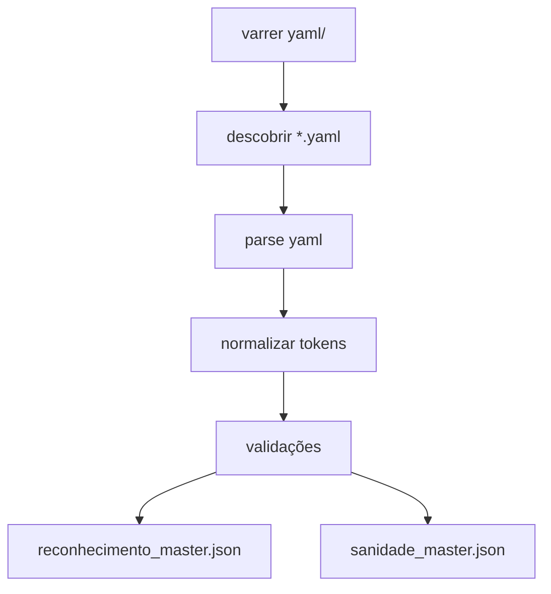

# Reconhecimento master

Build de regras de reconhecimento a partir de YAMLs para um único artefato JSON consumido no runtime.

## Objetivo

1. Ler todos os arquivos `yaml/**/*.yaml` (regras humanas)
2. Compilar para um master determinístico `reconhecimento_master.json` (runtime)
3. Gerar `sanidade_master.json` (auditoria, fingerprint, warnings)

## Escopo

* Somente o build: `yaml_to_master(...)`
* Não cobre telas Streamlit nem o pipeline de upload de Excel

---

## Layout recomendado do projeto

```
repo/
  yaml/
    elementos/
      concreto.yaml
    servicos/
      pintura.yaml
    unidades/
      unidades.yaml
  data/
    master/
      reconhecimento_master.json
      sanidade_master.json
  src/
    obra_taxonomia/
      build_master.py
```

Onde fica o master:

* `data/master/reconhecimento_master.json`
* `data/master/sanidade_master.json`

Alternativa (se você separar build de runtime):

* `build/reconhecimento_master.json`
* `build/sanidade_master.json`

---

## Índice

1. Padrão esperado dos YAMLs
2. Semântica de regra
3. Normalização
4. Contrato do JSON master
5. Índices para performance
6. Validações e warnings
7. Processo de build
8. Atualização: quando e como saber
9. Sanidade e auditoria
10. Testes mínimos

---

## 1) Padrão esperado dos YAMLs

Cada arquivo YAML contém uma lista de regras. Cada regra tem:

* `apelido`: string (chave única global)
* `unit`: string (unidade)
* `contem`: lista de listas (grupos obrigatórios)
* `ignorar`: lista de listas (grupos de exclusão) (opcional)

Exemplo (forma):

```yaml
- apelido: pilar_concreto_m3
  unit: m3
  contem:
    - [pilar, coluna]
    - [concreto]
  ignorar:
    - [tubo, dn, pead, pvc]
```

---

## 2) Semântica de regra

A regra é avaliada sobre `descricao_norm` (texto já normalizado no runtime).

### 2.1 `contem` (must)

* `contem` é uma lista de grupos
* Cada grupo é uma lista de sinônimos
* Para a regra passar: precisa aparecer pelo menos 1 token de cada grupo

Interpretação:

* `[[pilar, coluna], [concreto]]` significa:

  * (pilar ou coluna) e (concreto)

### 2.2 `ignorar` (must_not)

* `ignorar` é uma lista de grupos
* Se aparecer qualquer token de qualquer grupo, a regra falha

Interpretação:

* `[[tubo, dn, pead]]` significa:

  * se aparecer tubo ou dn ou pead, descartar

---

## 3) Normalização

Requisito: build e runtime precisam falar o mesmo idioma.

### 3.1 Normalização de tokens (build)

Aplicar para cada token em `contem` e `ignorar`:

1. `strip`
2. `lower`
3. remover acentos (recomendado)
4. remover pontuação fraca
5. colapsar espaços
6. remover duplicatas dentro do mesmo grupo
7. descartar token vazio

### 3.2 Normalização de unidade (build)

* Validar `unit` contra a base de unidades (`yaml/unidades` ou dicionário interno)
* Opcional: mapear equivalências

  * `m²` → `m2`
  * `m³` → `m3`

---

## 4) Contrato do JSON master

Arquivo: `data/master/reconhecimento_master.json`

Estrutura recomendada:

```json
{
  "version": "2026-01-23T00:00:00Z",
  "rules": [
    {
      "apelido": "pilar_concreto_m3",
      "unit": "m3",
      "must": [["pilar","coluna"],["concreto"]],
      "must_not": [["tubo","dn","pead","pvc"]],
      "meta": {
        "dominio": "elementos",
        "arquivo": "yaml/elementos/concreto.yaml",
        "ordem_no_arquivo": 12
      }
    }
  ],
  "index": {
    "by_apelido": {"pilar_concreto_m3": 0},
    "by_unit": {"m3": [0, 5, 9]}
  }
}
```

Regras do contrato:

* `must` e `must_not` são sempre listas de listas
* `must_not` deve existir (pode ser `[]`)
* `meta` sempre presente para debug
* `index` recomendado para performance

---

## 5) Índices para performance

### 5.1 `index.by_unit`

* Reduz o conjunto candidato no runtime
* Fluxo recomendado: filtrar por unidade antes de avaliar tokens

### 5.2 `index.by_apelido`

* Debug rápido e validação de unicidade

Ordem de avaliação no runtime:

1. filtrar por unidade (via `by_unit`)
2. eliminar por `must_not` (barato)
3. checar `must` (and por grupos)
4. pontuar e ordenar (top candidatos)

---

## 6) Validações e warnings

### 6.1 Falhas (build deve parar)

1. `apelido` duplicado entre arquivos
2. `unit` inválida
3. `contem` ausente ou vazio
4. após normalização, algum grupo vira vazio

### 6.2 Warnings (build continua e registra)

1. token aparece em `must` e `must_not` na mesma regra
2. regra genérica demais (tende a falso positivo)
3. regra sem `ignorar` (aceitável, mas pode ser fraca)

---

## 7) Processo de build (passo a passo)

1. Descobrir arquivos

   * varrer `yaml/` recursivamente e coletar `*.yaml`

2. Parse

   * carregar YAML → lista de dicts
   * capturar `ordem_no_arquivo`

3. Canonicalizar

   * normalizar tokens
   * preencher `ignorar=[]` quando ausente

4. Enriquecer metadados

   * `dominio`: pasta logo abaixo de `yaml/`
   * `arquivo`: caminho relativo

5. Validar global

   * unicidade de `apelido`
   * unidade válida
   * grupos não vazios

6. Gerar índices

   * `by_apelido`
   * `by_unit`

7. Persistir

   * `reconhecimento_master.json`
   * `sanidade_master.json`

Mermaid (compatível GitHub):



---

## 8) Atualização: quando e como saber

Regra simples:

* Atualize o master sempre que qualquer YAML mudar

  * novo YAML
  * YAML removido
  * YAML editado

Método robusto (automático):

1. No build, calcular `yaml_fingerprint` (hash determinístico do conteúdo de todos os YAMLs)

   * ordenar paths
   * hash por arquivo (conteúdo)
   * hash final agregado
2. Salvar o fingerprint em `sanidade_master.json`
3. Para decidir rebuild:

   * recalcular fingerprint atual
   * se diferente: rebuild
   * se igual: não mexer

Quando rodar o build:

* localmente: sempre que mexer em YAML
* git: pre-commit hook (opcional)
* deploy: CI gera e publica `data/master/*.json`

---

## 9) Sanidade e auditoria

Arquivo: `data/master/sanidade_master.json`

Campos recomendados:

* `version`
* `files_count`, `rules_count`
* distribuição por unidade
* `warnings`
* `duplicates` (se existir, build deveria falhar)
* `yaml_fingerprint` (hash determinístico)
* `built_from` (lista de YAMLs usados)
* `hash_master` (opcional: hash do JSON final)

---

## 10) Testes mínimos (casos críticos)

1. `apelido` duplicado em dois arquivos → build falha
2. `unit` inválida → build falha
3. regra com `contem` vazio → build falha
4. token com acento/caixa diferente → normaliza igual
5. após limpeza, grupo fica vazio → build falha
6. token em `must` e `must_not` → warning
7. determinismo: rodar duas vezes sem mudar YAML → JSON idêntico

---

## Assinatura sugerida da função

Sem travar seu design, a forma mais prática para o projeto:

* `yaml_to_master(yaml_root: str, out_dir: str, mode: str = "rebuild") -> dict`

Saídas em disco:

* `out_dir/reconhecimento_master.json`
* `out_dir/sanidade_master.json`
